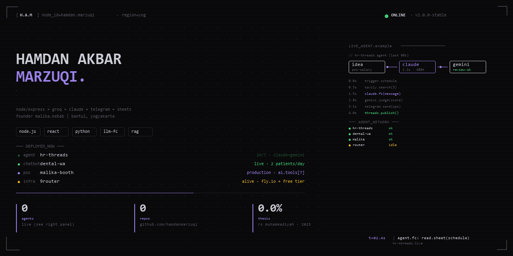

# <!-- Profile banner — drop into a repo named `HamdanMarzuqi/HamdanMarzuqi` -->
<!-- The image is rendered as a banner at the very top of the profile. -->

<p align="center">
  
</p>

<br/>

<div align="center">

```
$ whoami --full
→ Hamdan Akbar Marzuqi
  Web Developer · Agentic AI Integration
  Founder, Malika Kebab · Bantul, Yogyakarta
```

</div>

---

## // about

Saya IT graduate dengan spesialisasi **full-stack web development** dan **agentic AI integration**. Membangun sistem AI yang benar-benar di-*deploy* ke production — bukan demo.

Saat ini saya mengelola:

- **`malika-kebab-management-system`** — POS system untuk usaha keluarga. AI tools (7): parse order, upsell, stock warning, sales prediction. Live di production.
- **`hr-threads-agent`** — Content agent yang publish ke Threads. Pipeline: `claude → tavily → gemini-judge → publish`. Berjalan 24/7.
- **`dental-appointment-scheduling`** — WhatsApp chatbot untuk klinik gigi. RAG-grounded ke knowledge base klinik. Auto-booking.
- **`whatsapp-web-translator`** — Chrome extension (MV3) untuk translate 19 bahasa di WhatsApp Web. Groq llama-3.3-70b.

Tech yang saya pakai tiap hari: **Node.js, Express, React 19, Python, SQLite, Groq, Claude API, Google Sheets API, Telegram Bot API, Fly.io, 9Router.**

---

## // stack

**Production** &nbsp; `Node.js` `Express` `SQLite` `React 19` `Vite` `Tailwind` `Chrome MV3`
**AI / LLM** &nbsp; `Groq` `Claude API` `Gemini API` `Tavily` `Function Calling` `RAG`
**Infra** &nbsp; `Fly.io` `Google Sheets` `Telegram Bot` `9Router` `Cron` `Webhooks`

---

## // featured

<div align="center">

| | Project | Stack | Status |
|:---:|:---|:---|:---:|
| 01 | **[Malika Smart Booth POS](https://github.com/HamdanMarzuqi/Malika-Kebab-Management-System)** | Node · Express · SQLite · Groq | 🟢 Live |
| 02 | **[HR Threads Agent](https://github.com/HamdanMarzuqi/hr-threads-agent)** | Python · Claude · Gemini · Tavily | 🟢 Running |
| 03 | **[Dental WA Chatbot](https://github.com/HamdanMarzuqi/Dental-appointment-scheduling)** | Node · Groq · Sheets | 🟢 Live |
| 04 | **[WA Translator](https://github.com/HamdanMarzuqi/whatsapp-web-translator)** | React 19 · Vite · CRXJS MV3 | 🟢 Published |

</div>

---

## // live agents

```
agent.think  → claude.opus-4.8
agent.search → tavily.web(3)
agent.draft  → claude.fc.message()
agent.judge  → gemini.score(7)
agent.send   → telegram.ops
agent.post   → threads.publish
```

---

## // connect

- 💼 LinkedIn — [/in/hamdanmarzuqi](https://www.linkedin.com/in/hamdanmarzuqi)
- 📧 hamdan.marzuqi@gmail.com
- 🌐 Portfolio — [hamdanmarzuqi.dev](https://github.com/HamdanMarzuqi)
- 📍 Bantul, Yogyakarta · GMT+7

---

<p align="center">
  <sub><code>open to work · reply within 24h · based in yogyakarta, open to remote</code></sub>
</p>
